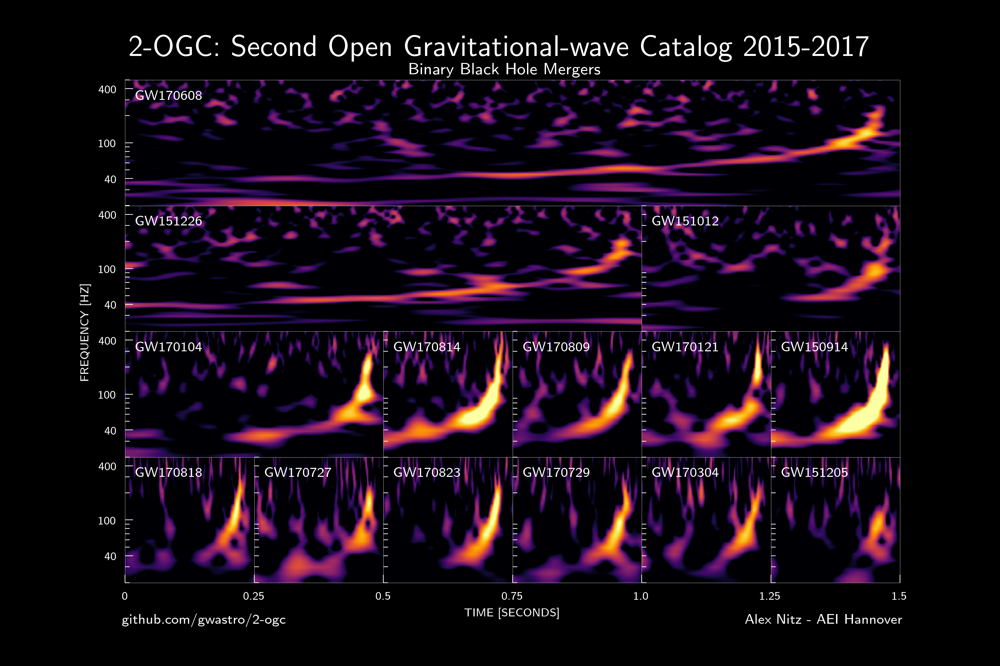

# 2-OGC: Open Gravitational-wave Catalog of binary mergers from analysis of public Advanced LIGO and Virgo data
**Alexander H. Nitz<sup>1, 2</sup>, Thomas Dent<sup>3</sup>, Gareth S. Davies<sup>3</sup>,Sumit Kumar<sup>1, 2</sup>, Collin D. Capano<sup>1, 2</sup>, Ian Harry<sup>4, 5</sup>, Simone Mozzon<sup>4</sup>, Laura Nuttall<sup>4</sup>, Andrew Lundgren<sup>4</sup>, and Marton Tapai<sup>6</sup> **

 <sub>1. [Albert-Einstein-Institut, Max-Planck-Institut for Gravitationsphysik, D-30167 Hannover, Germany](http://www.aei.mpg.de/obs-rel-cos)</sub>  
 <sub>2. Leibniz Universitat Hannover, D-30167 Hannover, Germany</sub>  
 <sub>3. Instituto Galego de F´ısica de Altas Enerx´ıas, Universidade de Santiago de Compostela, 15782 Santiago de Compostela, Galicia, Spain</sub>  
 <sub>4. University of Portsmouth, Portsmouth, PO1 3FX, United Kingdom</sub>  
 <sub>5. Kavli Institute of Theoretical Physics, UC Santa Barbara, CA</sub>  
 <sub>6. Department of Experimental Physics, University of Szeged, Szeged, 6720 D´om t´er 9., Hungary</sub>



## Introduction ##

We present the second Open Gravitational-wave Catalog (2-OGC) of compact-binary coalescences, obtained from the complete set of public data from Advanced LIGO's first and second observing runs. For the first time we also search public data from the Virgo observatory. The sensitivity of our search benefits from updated methods of ranking candidate events including the effects of non-stationary detector noise and varying network sensitivity; in a separate targeted binary black hole merger search we also impose a prior distribution of binary component masses. We identify a population of 14 binary black hole merger events with probability of astrophysical origin >0.5 as well as the binary neutron star merger GW170817. We confirm the previously reported events GW170121, GW170304, and GW170727 and also report GW151205, a new marginal binary black hole merger with a primary mass of 67+28−17M⊙ that may have formed through hierarchical merger. We find no additional significant binary neutron star merger or neutron star--black hole merger events. To enable deeper follow-up as our understanding of the underlying populations evolves, we make available our comprehensive catalog of events, including the sub-threshold population of candidates and posterior samples from parameter inference of the 30 most significant binary black hole candidates.

The catalog is stored in the file '2-OGC.hdf'. There are a variety of tools to access [hdf files](https://www.hdfgroup.org/) from numerous computing languages. Here we will focus on access through python and [h5py](www.h5py.org).

## Parameter Estimates for top 30 BBH candidates ##

Posteriors sample for the 30 most significant BBH candidates are located in the ['posterior_samples'](https://github.com/gwastro/2-ogc/tree/master/posterior_samples) folder.

The posterior samples are in the `samples` group in the posterior data hdf files. These may be read in a python environment using an installation of h5py. For example,
```
>>> import h5py
>>> fp = h5py.File('posterior_samples/H1L1V1-EXTRACT_POSTERIOR_150914_09H_50M_45UTC-0-1.hdf', 'r')
>>> fp['samples/mass1'][()]
array([35.44952146, 34.56030317, 40.06709433, ..., 34.56424324,
       33.19243344, 39.63952366])
```

Provided parameters are:
 * `mass1`: The source-frame mass of the larger object, in solar masses.
 * `mass2`: The source-frame mass of the smaller object, in solar masses.
 * `chi_eff`: The effective spin of the binary.
 * `chi_p`: The precessing-spin parameter of the binary.
 * `spin1_a`: The dimensionless spin-magnitude of the larger object.
 * `spin2_a`: The dimensionless spin-magnitude of the smaller object.
 * `spin1_azimuthal`: The azimuthal angle of the spin of the larger object.
 * `spin2_azimuthal`: The azimuthal angle of the spin of the smaller object.
 * `spin1_polar`: The polar angle of the spin of the spin of the larger object.
 * `spin2_polar`: The polar angle of the spin of the spin of the smaller object.
 * `tc`: The geocentric GPS time of the signal merger.
 * `ra`: The right ascension of the signal (in radians).
 * `dec`: The declination of the signal (in radians).
 * `distance`: The lumionsity distance to the signal (in Mpc).
 * `redshift`: The cosmological redshift of the signal.
 * `comoving_volume`: The comoving volume at the redshift of the signal.
 * `inclination`: The inclination of the binary's orbital angular momentum with
   respect to the line of sight, in radians. An inclination of 0 (pi)
   corresponds to a face-on (face-away) orientation.
 * `polarization`: The polarization angle of the gravitational wave.
 * `loglikelihood`: The natural log of the likelihood of each sample.
 * `logprior`: The natural log of the prior of each sample.
 * `logjacobian`: The natural log of the Jacobian between the parameter space and the sampling parameter-space that was used.

The samples group `attrs` (accessed via `fp['samples'].attrs`) contains the log of the likelihood assuming the noise hypothesis (`lognl`). Subtracting this from the `loglikelihood` gives the log of the likelihood ratio at each point. The `attrs` of the HDF files (accessed via `fp.attrs`) also contain metadata about the run.

## Catalog of Merger Candidates (including sub-threshold candidates) ##

### Analysis Details ###
Details of the analysis are available in this [preprint paper](https://arxiv.org/abs/1910.05331) and the configuration files needed to create the analysis workflows are provided in the [search_configs](https://github.com/gwastro/2-ogc/tree/master/search_configs) directory.

### Accessing the Catalog: 2-OGC.hdf ###

There are two datasets within the file, `/complete` and `/bbh`. The `complete` set is the full dataset from our analysis. The `bbh` set includes BBH candidates from the bbh-region targeted analysis. See the 2-OGC paper for additional information. 


```python
import h5py

catalog = h5py.File('./2-OGC.hdf', 'r')

# Get a numpy structured array of the candidate event properties.
all_candidates = catalog['complete']
bbh_candidates = catalog['bbh']

# Accessing a column by name
ranking_values = all_candidates['stat']

# Selecting parts of the catalog
region = all_candidates['mass1'] + all_candidates['mass2'] < 4
lowmass_candidates = all_candidates[region]

```


##### File format #####
Both datasets are structured arrays which have the following named columns. Some of these columns give information specific to either the 
LIGO Hanford, LIGO Livingston or Virgo detectors. Where this is the case, the name of the column is prefixed with either a `H1`, `L1`, or 'V1'.

| Key           | Description                                                                                                                         |
|---------------|-------------------------------------------------------------------------------------------------------------------------------------|
| name          | The designation of the candidate event. This is of the form 150812+12:23:04UTC.                                                     |
| far           | The rate of false alarms with a ranking statistic as large or larger than this event. The unit is yr^-1.                                                                                                           |
| stat          | The value of the ranking statistic for this candidate event.                                                                                       |
| mass1         | The component mass of one compact object in the template waveform which found this candidate. Units in detector frame solar masses. |
| mass2         | The component mass of the template waveform which found this candidate. Units in detector frame solar masses.                       |
| spin1z        | The dimensionless spin of one of the compact objects for the template waveform which found this candidate.                                                                                                                                  |
| spin2z        | The dimensionless spin of one of the compact objects for the template waveform which found this candidate.                                                                                                                                    |
| {H1/L1/V1}_end_time   | The time in GPS seconds when a fiducial point in the signal passes throught the detector. Typically this is near the time of merger.                                                                                                                              |                                                                                                                           |
| {H1/L1/V1}_snr        | The amplitude of the complex matched filter signal-to-noise observed.                                                                                                                                    |
| {H1/L1/V1}_coa_phase        | The phase (angle) of the complex matched filter signal-to-noise observed.                                                          |
| {H1/L1/V1}_reduced_chisq |  Value of the signal consistency test defined in this [paper](https://arxiv.org/abs/gr-qc/0405045). This is not calculated for all candidate events. In this case a value of 0 is substituted.                                                                                                                                  |
| {H1/L1/V1}_sg_chisq      |  Value of the signal consistency test defined in this [paper](https://arxiv.org/abs/1709.08974). This is not calculated for all candidate events. In this case a value of 1 is substituted.                                                                                                                     |
| {H1/L1/V1}_sigmasq       |   The integral of the template waveform divided by the power spectral density.

The `/bbh` dataset also has the following additional column.

| Key           | Description                                                                                                                         |
|---------------|-------------------------------------------------------------------------------------------------------------------------------------|
| pastro |     The probability that this BBH candidate is of astrophysical origin.                                        |
                     

## License and Citation


This work is licensed under a [Creative Commons Attribution-ShareAlike 3.0 United States License](http://creativecommons.org/licenses/by-sa/3.0/us/).

We encourage use of these data in derivative works. If you use the material provided here, please cite the paper using the reference:

```
@article{Nitz:2019hdf,
      author         = "Nitz, Alexander H. and Dent, Thomas and Davies, Gareth S.
                        and Kumar, Sumit and Capano, Collin D. and Harry, Ian and
                        Mozzon, Simone and Nuttall, Laura and Lundgren, Andrew and
                        Tápai, Marton",
      title          = "{2-OGC: Open Gravitational-wave Catalog of binary mergers
                        from analysis of public Advanced LIGO and Virgo data}",
      year           = "2019",
      eprint         = "1910.05331",
      archivePrefix  = "arXiv",
      primaryClass   = "astro-ph.HE",
      SLACcitation   = "%%CITATION = ARXIV:1910.05331;%%"
}
```


## Acknowledgments ##
We acknowledge the Max Planck Gesellschaft and the Atlas cluster computing team at AEI Hannover for support. Research supported by Maria de Maeztu Unit of Excellence MDM-2016-0692. This research was supported in part by the National Science Foundation under Grant No. NSF PHY-1748958. This research has made use of data, software and/or web tools obtained from the Gravitational Wave Open Science Center (https://www.gw-openscience.org), a service of LIGO Laboratory, the LIGO Scientific Collaboration and the Virgo Collaboration. LIGO is funded by the U.S. National Science Foundation. Virgo is funded by the French Centre National de Recherche Scientifique (CNRS), the Italian Istituto Nazionale della Fisica Nucleare (INFN) and the Dutch Nikhef, with contributions by Polish and Hungarian institutes.
